# Awesome-Robot-Cell-Simulation

## Top Robot Cell Simulation — README.md


A comprehensive guide to **robot-cell simulation, industrial robot simulation, offline programming, robotic workcell design, digital twins, robot path planning, collision detection, process simulation, manufacturing simulation, virtual commissioning, and open-source alternatives** to leading platforms such as **ABB RobotStudio, KUKA.Sim, Visual Components, Siemens Process Simulate, FANUC ROBOGUIDE, Visual Components Premium, DELMIA Robotics, OCTOPUZ, RoboDK, and Visual Components Essentials**.


> **Primary emphasis:** Open-source robot simulation, physics engines, industrial robotics frameworks, robot programming libraries, CAD/geometry platforms, motion-planning systems, digital-twin tools, and composable software that can be combined into a self-hosted alternative to commercial robot-cell simulation environments.


---


## Table of Contents


* [What Is Robot Cell Simulation?](#what-is-robot-cell-simulation)

* [SaaS / Hosted Platforms](#saas--hosted-platforms)

* [Open-Source](#open-source)


  * [Complete / General Robotics Simulators](#complete--general-robotics-simulators)

  * [Industrial Robot Simulation & Motion Planning](#industrial-robot-simulation--motion-planning)

  * [Physics Engines](#physics-engines)

  * [Robot Modeling & Kinematics](#robot-modeling--kinematics)

  * [CAD / 3D / Geometry](#cad--3d--geometry)

  * [Path Planning & Trajectory Optimization](#path-planning--trajectory-optimization)

  * [ROS / ROS 2 Robotics](#ros--ros-2-robotics)

  * [Digital Twin & Visualization](#digital-twin--visualization)

  * [Computer Vision & Perception](#computer-vision--perception)

  * [Manufacturing / Process Simulation Building Blocks](#manufacturing--process-simulation-building-blocks)

  * [Simulation Data & Automation](#simulation-data--automation)

  * [Testing & Benchmarking](#testing--benchmarking)

* [Commercial → Open-Source Mapping](#commercial--open-source-mapping)

* [Robot Cell Simulation Problem Domains](#robot-cell-simulation-problem-domains)

* [Core Architecture](#core-architecture)

* [Reference Architecture](#reference-architecture)

* [Industrial Robot Cell Architecture](#industrial-robot-cell-architecture)

* [Offline Programming Architecture](#offline-programming-architecture)

* [Virtual Commissioning Architecture](#virtual-commissioning-architecture)

* [Digital Twin Architecture](#digital-twin-architecture)

* [Robot Path Planning Architecture](#robot-path-planning-architecture)

* [Collision Detection Architecture](#collision-detection-architecture)

* [Capability Matrix](#capability-matrix)

* [Recommended Open-Source Stacks](#recommended-open-source-stacks)

* [Best Open-Source Choices by Use Case](#best-open-source-choices-by-use-case)

* [What Open Source Can and Cannot Replace](#what-open-source-can-and-cannot-replace)

* [Robot Cell Data Model](#robot-cell-data-model)

* [Robot Model](#robot-model)

* [Workcell Model](#workcell-model)

* [Robot Programming](#robot-programming)

* [Offline Programming](#offline-programming)

* [Path Planning](#path-planning)

* [Collision Detection](#collision-detection)

* [Reachability Analysis](#reachability-analysis)

* [Cycle-Time Analysis](#cycle-time-analysis)

* [Digital Twin](#digital-twin)

* [Virtual Commissioning](#virtual-commissioning)

* [CAD Integration](#cad-integration)

* [Manufacturing Process Simulation](#manufacturing-process-simulation)

* [Robot Calibration](#robot-calibration)

* [Simulation-to-Real](#simulation-to-real)

* [AI / ML Integration](#ai--ml-integration)

* [Security & Deployment](#security--deployment)

* [Scalability](#scalability)

* [Licensing](#licensing)

* [Open-Source Ecosystem Summary](#open-source-ecosystem-summary)

* [Open-Source Shortlist](#open-source-shortlist)

* [Why Gazebo Is Particularly Important](#why-gazebo-is-particularly-important)

* [Why CoppeliaSim Is Particularly Interesting](#why-coppeliasim-is-particularly-interesting)

* [Why MuJoCo Is Particularly Interesting](#why-mujoco-is-particularly-interesting)

* [Why Drake Is Particularly Interesting](#why-drake-is-particularly-interesting)

* [Building an ABB RobotStudio Alternative](#building-an-abb-robotstudio-alternative)

* [Building a KUKA.Sim Alternative](#building-a-kukasim-alternative)

* [Building a FANUC ROBOGUIDE Alternative](#building-a-fanuc-roboguide-alternative)

* [Building a RoboDK Alternative](#building-a-robodk-alternative)

* [Building a Visual Components Alternative](#building-a-visual-components-alternative)

* [Building a Siemens Process Simulate Alternative](#building-a-siemens-process-simulate-alternative)

* [Building an OCTOPUZ Alternative](#building-an-octopuz-alternative)

* [Building a DELMIA Robotics Alternative](#building-a-delmia-robotics-alternative)

* [Building a Fully Open Robot Cell Simulator](#building-a-fully-open-robot-cell-simulator)

* [Conclusion](#conclusion)

* [Contributing](#contributing)

* [Disclaimer](#disclaimer)


---


# What Is Robot Cell Simulation?


Robot-cell simulation is the virtual representation of an industrial robotic workcell before the physical system is commissioned.


A simulated cell may contain:


* Industrial robot arms

* Robot controllers

* End-of-arm tooling

* Grippers

* Welding guns

* Conveyors

* Fixtures

* Parts

* Pallets

* Sensors

* Cameras

* Safety equipment

* PLCs

* External axes

* Positioners

* Turntables

* Linear tracks

* Humans

* AGVs / AMRs

* Production lines

* Manufacturing processes


A typical workflow is:


```text

CAD / Layout

     │

     ▼

Robot Model

     │

     ▼

Workcell Construction

     │

     ▼

Kinematics

     │

     ▼

Path Planning

     │

     ▼

Collision Detection

     │

     ▼

Process Simulation

     │

     ▼

Cycle-Time Analysis

     │

     ▼

Offline Programming

     │

     ▼

Virtual Commissioning

     │

     ▼

Physical Robot

```


Commercial platforms combine many of these capabilities into one environment. ABB RobotStudio, for example, uses an ABB Virtual Controller to closely reproduce controller behavior and supports offline programming, path planning and cell simulation.


---


# SaaS / Hosted Platforms


The industrial robot simulation market is still dominated by **desktop/engineering software rather than pure SaaS**, although cloud collaboration, cloud licensing, digital twins and hosted engineering workflows are increasingly common.


| Platform                                                                                                    | Primary Focus             | Typical Strength                        |

| ----------------------------------------------------------------------------------------------------------- | ------------------------- | --------------------------------------- |

| [ABB RobotStudio](https://new.abb.com/products/robotics/software-and-digital/robotstudio)                   | Robot simulation / OLP    | ABB virtual controller                  |

| [KUKA.Sim](https://www.kuka.com/)                                                                           | Robot simulation          | KUKA cell programming                   |

| [Visual Components](https://www.visualcomponents.com/)                                                      | Factory / cell simulation | Layout + manufacturing simulation       |

| [Siemens Process Simulate](https://plm.sw.siemens.com/en-US/tecnomatix/products/process-simulate-software/) | Manufacturing simulation  | Virtual commissioning                   |

| [FANUC ROBOGUIDE](https://www.fanucamerica.com/)                                                            | Robot simulation          | FANUC offline programming               |

| [DELMIA Robotics](https://www.3ds.com/products/delmia)                                                      | Manufacturing / robotics  | Enterprise digital manufacturing        |

| [OCTOPUZ](https://octopuz.com/)                                                                             | Offline programming       | Multi-brand robotic OLP                 |

| [RoboDK](https://robodk.com/)                                                                               | Robot simulation / OLP    | Multi-brand robot programming           |

| [Visual Components Premium](https://www.visualcomponents.com/)                                              | Factory simulation        | Advanced cell/layout simulation         |

| [Visual Components Essentials](https://www.visualcomponents.com/)                                           | Manufacturing simulation  | Entry-level cell simulation             |

| [ABB RobotStudio Suite](https://www.abb.com/)                                                               | Industrial robotics       | Virtual controller + OLP                |

| [Siemens Tecnomatix](https://plm.sw.siemens.com/en-US/tecnomatix/)                                          | Digital manufacturing     | Factory/process simulation              |

| [Dassault Systèmes 3DEXPERIENCE](https://www.3ds.com/)                                                      | Digital manufacturing     | Enterprise digital twin                 |

| [Hexagon RobotStudio / simulation ecosystem](https://hexagon.com/)                                          | Manufacturing simulation  | Metrology + automation                  |

| [MotoSim](https://www.motoman.com/)                                                                         | Robot simulation          | Yaskawa offline programming             |

| [FANUC ROBOGUIDE](https://www.fanucamerica.com/)                                                            | Robot OLP                 | FANUC controller simulation             |

| [KUKA.Sim](https://www.kuka.com/)                                                                           | Robot OLP                 | KUKA-specific simulation                |

| [RoboDK](https://robodk.com/)                                                                               | Multi-brand OLP           | 1,400+ robot models / 80+ manufacturers |

| [OCTOPUZ](https://octopuz.com/)                                                                             | Robotic programming       | Complex path generation                 |


RoboDK is particularly notable among commercial tools because it supports a very large range of industrial robots and can generate controller-specific programs through post-processors.


---


# Open-Source


> **Important distinction:** there is no single fully open-source package that reproduces the complete functionality of RobotStudio, KUKA.Sim, Visual Components, Process Simulate or DELMIA. The strongest open-source approach is compositional: combine a simulator, physics engine, robot model, motion planner, CAD/geometry engine, collision checker and manufacturing logic.


The open-source ecosystem can be represented as:


```text

                     Open Robot Cell Stack

                              │

        ┌─────────────────────┼─────────────────────┐

        │                     │                     │

        ▼                     ▼                     ▼

    Simulator             Robot Model            CAD / 3D

        │                     │                     │

        ▼                     ▼                     ▼

    Physics              Kinematics             Geometry

        │                     │                     │

        └─────────────────────┼─────────────────────┘

                              ▼

                       Motion Planning

                              │

                              ▼

                     Collision Detection

                              │

                              ▼

                      Process Simulation

                              │

                              ▼

                     Offline Programming

                              │

                              ▼

                     Virtual Commissioning

```


---


# Complete / General Robotics Simulators


## 1. Gazebo


GitHub:


https://github.com/gazebosim/gz-sim


Website:


https://gazebosim.org/


License: **Apache-2.0**


Gazebo is one of the most important open-source robotics simulation platforms.


It supports:


* 3D simulation

* Robot models

* Sensors

* Physics

* Manipulators

* Mobile robots

* ROS 2 integration

* Navigation

* Industrial robotics

* Simulation worlds

* Plugin-based extensions


Gazebo is particularly strong when the simulation must integrate tightly with ROS 2.


```text

ROS 2

  │

  ▼

Gazebo

  │

  ├── Robot

  ├── Sensors

  ├── Environment

  ├── Physics

  └── Controllers

```


Current Gazebo is the successor to the older Gazebo Classic ecosystem; Gazebo Classic should not be selected for new deployments.


---


# 2. Webots


GitHub:


https://github.com/cyberbotics/webots


Website:


https://cyberbotics.com/


License: **Apache-2.0**


Webots is a complete open-source robot simulator.


It provides:


* 3D worlds

* Physics

* Robot models

* Sensors

* Cameras

* Manipulators

* Mobile robots

* Controllers

* ROS integration

* Python/C/C++/Java/MATLAB interfaces


It is particularly useful for:


* Education

* Research

* Prototyping

* Multi-robot simulation

* Robot algorithm development


---


# 3. MuJoCo


GitHub:


https://github.com/google-deepmind/mujoco


Website:


https://mujoco.org/


License: **Apache-2.0**


MuJoCo is an extremely powerful physics engine for:


* Robot dynamics

* Manipulators

* Contact simulation

* Control

* Reinforcement learning

* Motion optimization

* Physics research


It is particularly strong for high-quality robot dynamics and control research.


A current robotics-simulator comparison lists MuJoCo among the major open-source simulation choices alongside Gazebo, Webots and other systems.


---


# 4. CoppeliaSim


Website:


https://www.coppeliarobotics.com/


CoppeliaSim is a highly capable robotics simulator with:


* 3D simulation

* Physics engines

* Robot arms

* Sensors

* Motion planning

* Remote APIs

* Python

* C/C++

* Lua

* MATLAB integration

* ROS / ROS 2 integration

* Industrial robot simulation


It is particularly strong for robotic manipulators and integrated simulation.


> **Licensing note:** CoppeliaSim is widely used and has freely available/educational editions, but it should **not automatically be classified as OSI open-source software**. Verify the license of the exact edition before including it in a strictly open-source production stack.


Independent simulator comparisons have evaluated CoppeliaSim alongside Gazebo, Webots and other robotics simulators.


---


# 5. PyBullet


GitHub:


https://github.com/bulletphysics/bullet3


PyBullet is a Python-friendly robotics simulation environment based on Bullet.


Useful for:


* Manipulators

* Physics

* Reinforcement learning

* Motion planning

* Robot control

* Prototyping

* Batch simulation


---


# 6. Drake


GitHub:


https://github.com/RobotLocomotion/drake


Website:


https://drake.mit.edu/


License: **BSD-3-Clause**


Drake is an open-source toolbox for:


* Robot dynamics

* Kinematics

* Optimization

* Control

* Motion planning

* Manipulation

* Trajectory optimization

* Simulation


Drake is especially strong for mathematically rigorous robotics applications.


---


# 7. Newton


GitHub:


https://github.com/newton-physics/newton


Newton is an open-source GPU-accelerated physics simulation framework built around NVIDIA Warp.


Useful for:


* Robotics

* GPU physics

* Manipulation

* Large-scale simulation

* AI / reinforcement learning


The current open-source simulator ecosystem lists Newton among newer GPU-focused robotics physics systems.


---


# 8. Open Robotics Simulation Ecosystem


The Open Robotics ecosystem provides a strong combination of:


```text

ROS 2

+

Gazebo

+

Nav2

+

MoveIt 2

+

ros2_control

```


This combination is particularly powerful for building an open industrial robotics simulation environment.


---


# Industrial Robot Simulation & Motion Planning


## MoveIt 2


GitHub:


https://github.com/moveit/moveit2


Website:


https://moveit.picknik.ai/


License: **BSD-3-Clause**


MoveIt 2 is one of the most important open-source frameworks for robot manipulation.


Capabilities include:


* Motion planning

* Collision checking

* Inverse kinematics

* Forward kinematics

* Robot trajectories

* Planning scenes

* Manipulation

* ROS 2 integration


Architecture:


```text

Robot Model

     │

     ▼

MoveIt 2

     │

     ├── IK

     ├── Planning

     ├── Collision

     └── Trajectory

            │

            ▼

       ROS 2 Control

```


---


# Tesseract Robotics


GitHub:


https://github.com/tesseract-robotics/tesseract


Tesseract is particularly relevant to industrial robotics.


It provides capabilities around:


* Robot environment representation

* Collision checking

* Kinematics

* Trajectory processing

* Motion planning

* Industrial robotics

* Process planning


It is an especially interesting building block for an open-source industrial OLP system.


---


# ROS-Industrial


Website:


https://rosindustrial.org/


GitHub:


https://github.com/ros-industrial


ROS-Industrial extends ROS into industrial manufacturing.


It includes support and packages around:


* Industrial robot arms

* Drivers

* Calibration

* Manufacturing

* Motion planning

* Robot programming

* Industrial interfaces


This ecosystem is highly relevant when building an open alternative to industrial robot simulation suites.


---


# ROS-Industrial Training / Simulation Ecosystem


Useful components include:


* Industrial robot drivers

* Universal Robot packages

* ABB packages

* FANUC packages

* Motoman packages

* KUKA packages

* MoveIt integration

* Gazebo simulation

* ROS 2


---


# Industrial Robot Support


Open-source robot models and ROS integrations are available for many manufacturers, including:


* ABB

* FANUC

* KUKA

* Yaskawa

* Universal Robots

* Doosan

* Staubli

* Kawasaki

* Epson

* Denso

* Franka

* Kinova


Availability and maintenance vary by robot family and repository.


---


# Physics Engines


A robot-cell simulator requires a physics engine when realistic physical interaction is important.


| Engine                                              | License      | Strength                   |

| --------------------------------------------------- | ------------ | -------------------------- |

| [MuJoCo](https://github.com/google-deepmind/mujoco) | Apache-2.0   | Robot dynamics             |

| [Bullet](https://github.com/bulletphysics/bullet3)  | zlib         | General robotics physics   |

| [DART](https://github.com/dartsim/dart)             | BSD          | Robotics dynamics          |

| [ODE](https://www.ode.org/)                         | BSD-style    | Classic rigid-body physics |

| [PhysX](https://github.com/NVIDIA-Omniverse/PhysX)  | BSD-3-Clause | High-performance physics   |

| [Drake](https://github.com/RobotLocomotion/drake)   | BSD-3-Clause | Dynamics + optimization    |

| [Newton](https://github.com/newton-physics/newton)  | Open source  | GPU robotics physics       |


A simulator may expose several physics backends.


```text

Gazebo

  │

  ├── Physics

  ├── Sensors

  ├── Plugins

  └── Robot Models

```


---


# Robot Modeling & Kinematics


## URDF


URDF is the standard robot-description format widely used in ROS.


It represents:


* Links

* Joints

* Inertial properties

* Collision geometry

* Visual geometry

* Sensors

* Transmissions


Example:


```xml

<robot name="industrial_arm">


  <link name="base"/>


  <joint name="joint_1"

         type="revolute">

    <parent link="base"/>

    <child link="link_1"/>

  </joint>


</robot>

```


---


# SDF


Simulation Description Format:


https://sdformat.org/


SDF is particularly important for Gazebo simulation.


It can represent:


* Robots

* Worlds

* Sensors

* Physics

* Lights

* Models

* Plugins


---


# KDL


GitHub:


https://github.com/orocos/orocos_kinematics_dynamics


KDL provides:


* Forward kinematics

* Inverse kinematics

* Jacobians

* Dynamics


---


# Pinocchio


GitHub:


https://github.com/stack-of-tasks/pinocchio


License: BSD-2-Clause


Pinocchio provides fast rigid-body dynamics and kinematics.


Useful for:


* Manipulators

* Optimization

* Control

* Whole-body robotics

* Motion planning


---


# Robotics Toolbox


GitHub:


https://github.com/petercorke/robotics-toolbox-python


Useful for:


* Kinematics

* Dynamics

* Robot models

* Trajectory generation

* Teaching

* Research


---


# CAD / 3D / Geometry


## FreeCAD


Website:


https://www.freecad.org/


GitHub:


https://github.com/FreeCAD/FreeCAD


License: LGPL-2.1-or-later


FreeCAD is an open-source parametric CAD platform.


Useful for:


* Workcell layout

* Fixtures

* Robot tooling

* Mechanical components

* Manufacturing geometry

* CAD-to-simulation workflows


---


# Blender


Website:


https://www.blender.org/


GitHub:


https://github.com/blender/blender


License: GPL-3.0


Blender is an extremely powerful open-source 3D environment.


Useful for:


* Cell visualization

* Asset creation

* Rendering

* Animation

* Synthetic data

* Robot visualization

* Digital twins

* Environment creation


It is not an industrial robot simulator by itself, but it is a powerful component of a custom simulation platform.


---


# Open Cascade


Website:


https://www.opencascade.com/


Open CASCADE Technology:


https://github.com/Open-Cascade-SAS/OCCT


License: LGPL-2.1 with additional terms


Provides a powerful geometric modeling kernel for:


* CAD

* STEP

* IGES

* B-Rep

* Boolean geometry

* Surface modeling

* Geometry processing


---


# Open3D


GitHub:


https://github.com/isl-org/Open3D


License: MIT


Useful for:


* 3D geometry

* Point clouds

* Meshes

* 3D reconstruction

* Perception

* Digital twins


---


# Assimp


GitHub:


https://github.com/assimp/assimp


Open Asset Import Library.


Useful for importing:


* OBJ

* FBX

* STL

* Collada

* glTF

* Other 3D formats


into simulation and visualization applications.


---


# Path Planning & Trajectory Optimization


## OMPL


Website:


https://ompl.kavrakilab.org/


GitHub:


https://github.com/ompl/ompl


License: BSD


Open Motion Planning Library.


Provides algorithms such as:


* RRT

* RRT*

* PRM

* KPIECE

* EST

* FMT

* BIT*


OMPL is foundational for robotic motion planning.


---


# MoveIt 2 Planning


MoveIt 2 can integrate:


* OMPL

* Pilz Industrial Motion Planner

* CHOMP

* STOMP

* Trajectory optimization

* Custom planners


This makes it especially relevant to an open-source alternative to commercial robot-programming environments.


---


# CHOMP


Covariant Hamiltonian Optimization for Motion Planning.


Useful for:


* Smooth trajectories

* Collision avoidance

* Trajectory optimization

* Manipulator motion


---


# STOMP


Stochastic Trajectory Optimization for Motion Planning.


Useful for:


* Nonlinear trajectory optimization

* Collision-aware motion

* Manipulator planning


---


# TrajOpt


GitHub:


https://github.com/tesseract-robotics/trajopt


Trajectory optimization framework.


Useful for:


* Collision-aware trajectories

* Manipulator motion

* Industrial robot path planning


---


# TOPP-RA


GitHub:


https://github.com/hungpham2511/toppra


Time-optimal path parameterization.


Useful for:


* Robot trajectories

* Velocity constraints

* Acceleration constraints

* Torque constraints


---


# Collision Detection


## FCL


GitHub:


https://github.com/flexible-collision-library/fcl


Flexible Collision Library.


Provides:


* Collision detection

* Distance queries

* Continuous collision checking

* Collision geometry


Widely relevant to robotics.


---


## Bullet Collision Detection


Bullet provides:


* Collision detection

* Rigid-body simulation

* Ray casting

* Contact detection


---


## hpp-fcl


GitHub:


https://github.com/humanoid-path-planner/hpp-fcl


A fast collision-detection library used in robotics.


---


# Digital Twin & Visualization


## RViz 2


ROS visualization environment.


Useful for:


* Robot state

* TF

* Sensors

* Point clouds

* Planning scenes

* Paths

* Robot models


---


## Foxglove


https://foxglove.dev/


Useful for:


* Robot telemetry

* 3D visualization

* ROS data

* Logs

* Sensor visualization

* Simulation debugging


> Foxglove has both open-source and commercial components; verify the licensing of the specific component used.


---


## OpenSceneGraph


https://github.com/openscenegraph/OpenSceneGraph


Open-source 3D graphics toolkit.


---


## Three.js


https://threejs.org/


Useful for building browser-based robot-cell visualization.


---


## Babylon.js


https://github.com/BabylonJS/Babylon.js


Useful for:


* Web-based 3D

* Digital twins

* Interactive factory layouts

* Browser simulation interfaces


---


# Computer Vision & Perception


## OpenCV


https://opencv.org/


Essential for:


* Vision

* Calibration

* Object detection pipelines

* Image processing

* Camera simulation


---


## PCL


https://pointclouds.org/


Point Cloud Library.


Useful for:


* 3D perception

* Point clouds

* Registration

* Segmentation

* Surface reconstruction


---


## Open3D


https://github.com/isl-org/Open3D


Useful for:


* Point-cloud processing

* 3D reconstruction

* Digital twins

* Synthetic-to-real workflows


---


# Manufacturing / Process Simulation Building Blocks


A complete Process Simulate / DELMIA / Visual Components alternative requires more than robot dynamics.


It must model:


* Conveyors

* Production stations

* PLC logic

* Material flow

* Operators

* Buffers

* Machines

* Robots

* Fixtures

* Cycle times

* Process dependencies


Open-source components can be combined:


```text

Robot Simulator

+

CAD

+

Discrete-Event Simulation

+

PLC Simulation

+

Robot Controller

+

MES/ERP Interfaces

```


---


# Discrete-Event Simulation


## SimPy


GitHub:


https://github.com/simpx/simpy


License: MIT


Python-based discrete-event simulation framework.


Useful for:


* Manufacturing flow

* Queues

* Buffers

* Production scheduling

* Factory throughput


---


## Salabim


https://www.salabim.org/


Python discrete-event simulation framework.


---


## JaamSim


https://jaamsim.com/


Open-source discrete-event simulation software.


Useful for:


* Manufacturing

* Logistics

* Queuing

* Process analysis


---


# PLC / Automation Simulation


A true Process Simulate alternative often needs PLC logic.


Useful open-source or freely available building blocks include:


* OpenPLC

* Eclipse 4diac

* Node-RED

* Modbus

* OPC UA implementations

* MQTT


---


## OpenPLC


https://autonomylogic.com/


OpenPLC is an open-source PLC platform.


Useful for:


* PLC logic

* Automation experiments

* Virtual commissioning

* Industrial control prototyping


---


## Eclipse 4diac


https://www.eclipse.org/4diac/


Open-source industrial control framework.


Useful for:


* IEC 61499

* Distributed automation

* Industrial control

* PLC research


---


# Simulation Data & Automation


## ROS 2 Bags


Useful for:


* Recording simulation

* Replaying robot motion

* Regression testing

* Hardware comparison


---


## MCAP


GitHub:


https://github.com/foxglove/mcap


Useful for:


* Simulation logs

* Robot data

* Sensor data

* Test results


---


## Python


Python is central to automating open-source simulation workflows.


Typical automation:


```python

load_cell()

load_robot()

load_part()

generate_path()

check_collisions()

simulate_cycle()

export_program()

```


---


# Testing & Benchmarking


A serious robot-cell simulation platform should support:


* Regression testing

* Collision tests

* Reachability tests

* Cycle-time tests

* Path validation

* Controller tests

* Robot-model tests

* Simulation-to-real comparison


A published simulator comparison has evaluated CoppeliaSim, Gazebo, MORSE and Webots against real robot motion data, illustrating the importance of empirical simulator validation.


---


# Commercial → Open-Source Mapping


| Commercial Platform              | Closest Open-Source Building Blocks                                       |

| -------------------------------- | ------------------------------------------------------------------------- |

| **ABB RobotStudio**              | Gazebo + ROS 2 + MoveIt 2 + Tesseract + robot-specific ROS packages       |

| **KUKA.Sim**                     | Gazebo + MoveIt 2 + Tesseract + KUKA ROS packages                         |

| **Visual Components**            | Gazebo + FreeCAD + Blender + SimPy/JaamSim + ROS 2                        |

| **Siemens Process Simulate**     | Gazebo + FreeCAD + OpenPLC + SimPy + ROS 2                                |

| **FANUC ROBOGUIDE**              | Gazebo + MoveIt 2 + FANUC ROS packages + Tesseract                        |

| **Visual Components Premium**    | Gazebo + FreeCAD + Blender + discrete-event simulation                    |

| **DELMIA Robotics**              | ROS 2 + MoveIt 2 + Tesseract + FreeCAD + OpenCascade + process simulation |

| **OCTOPUZ**                      | MoveIt 2 + Tesseract + TrajOpt + OMPL + robot post-processors             |

| **RoboDK**                       | MoveIt 2 + Tesseract + OMPL + robot drivers + custom post-processors      |

| **Visual Components Essentials** | Gazebo + FreeCAD + Blender + ROS 2                                        |

| **ABB RobotStudio**              | ROS 2 + MoveIt 2 + Tesseract + Gazebo                                     |

| **KUKA.Sim**                     | ROS 2 + MoveIt 2 + Gazebo                                                 |

| **FANUC ROBOGUIDE**              | ROS 2 + Gazebo + MoveIt 2                                                 |

| **MotoSim**                      | ROS 2 + MoveIt 2 + Gazebo + Yaskawa ROS packages                          |

| **Process Simulate**             | Gazebo + OpenPLC + SimPy + FreeCAD                                        |

| **DELMIA**                       | OpenCascade + FreeCAD + Gazebo + ROS 2 + process simulation               |


> These are **architectural equivalents**, not drop-in replacements. Commercial platforms include proprietary robot-controller models, manufacturer libraries, engineering workflows, post-processors and industrial validation that an open-source stack must recreate separately.


---


# Robot Cell Simulation Problem Domains


A modern robot-cell simulator should handle at least the following.


## 1. Cell Layout


```text

Robot

+

Fixture

+

Part

+

Conveyor

+

Safety Fence

+

Operator

+

Sensors

```


---


## 2. Robot Kinematics


For a 6-axis robot:


```text

Base

 │

J1

 │

J2

 │

J3

 │

J4

 │

J5

 │

J6

 │

Tool

```


The simulator must calculate:


* Joint positions

* TCP position

* Orientation

* Reachability

* Singularities

* Joint limits


---


# Core Architecture


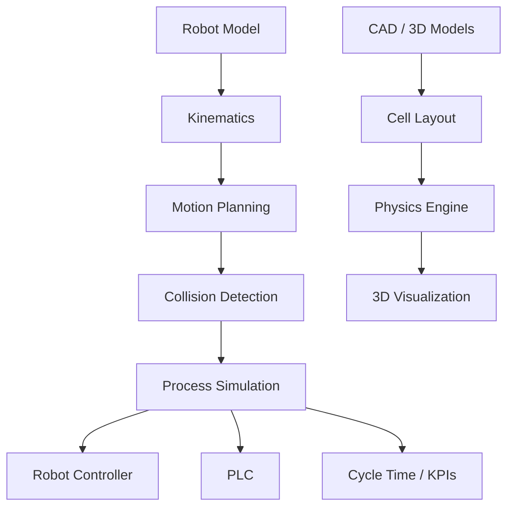


---


# Reference Architecture


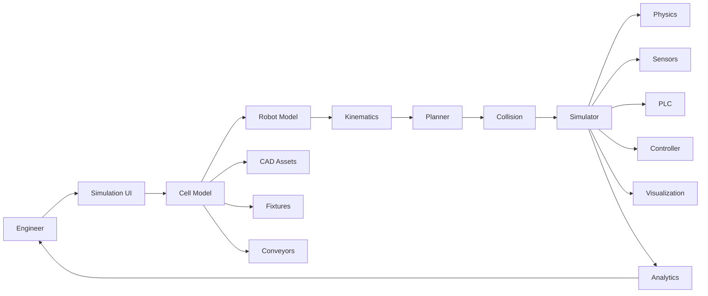


---


# Industrial Robot Cell Architecture


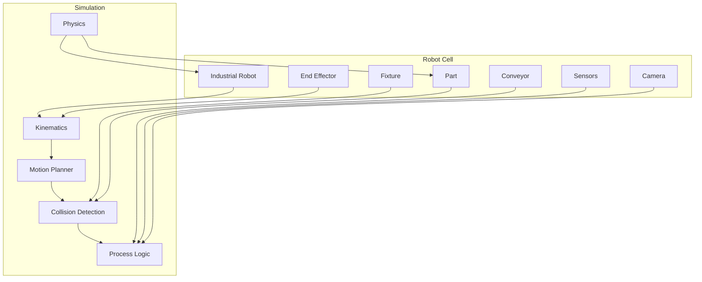


---


# Offline Programming Architecture


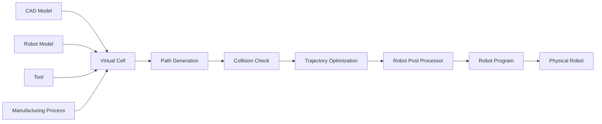


---


# Virtual Commissioning Architecture


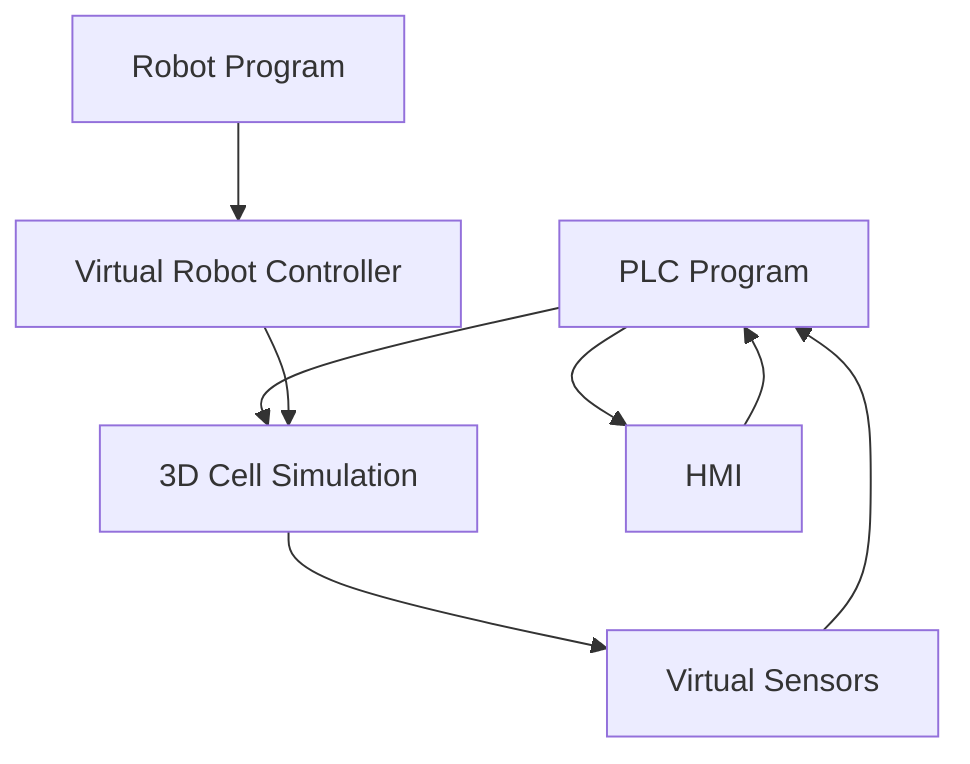


Virtual commissioning aims to test automation logic before the physical production cell is available.


---


# Digital Twin Architecture


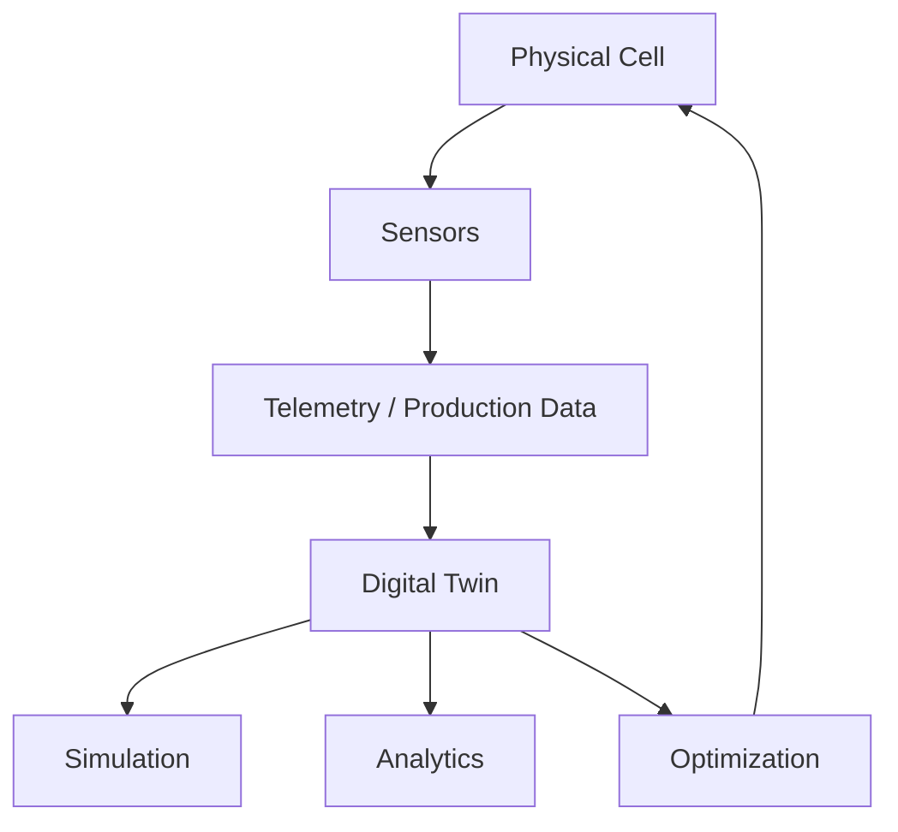


A digital twin becomes significantly more valuable when the model is synchronized with:


* Robot position

* PLC state

* Production state

* Cycle times

* Machine state

* Tool condition

* Sensor data


---


# Robot Path Planning Architecture


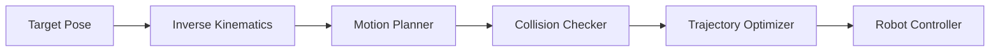


---


# Collision Detection Architecture


```text id="5p4r8w"

Robot

  │

  ├── Link 1

  ├── Link 2

  ├── Link 3

  ├── Link 4

  ├── Link 5

  └── Link 6

         │

         ▼

Collision Geometry

         │

 ┌───────┼────────┐

 ▼       ▼        ▼

Part   Fixture  Environment

```


Collision checks should include:


* Robot vs part

* Robot vs fixture

* Robot vs robot

* Tool vs part

* Tool vs fixture

* External axis vs robot

* Robot vs safety fence

* Part vs conveyor


---


# Capability Matrix


| Capability            | RobotStudio | KUKA.Sim | Visual Components | Process Simulate |  RoboDK |        Gazebo | MoveIt 2 | Tesseract |

| --------------------- | ----------: | -------: | ----------------: | ---------------: | ------: | ------------: | -------: | --------: |

| 3D Cell               |           ✅ |        ✅ |                 ✅ |                ✅ |       ✅ |             ✅ |  Partial |   Partial |

| Robot Simulation      |           ✅ |        ✅ |                 ✅ |                ✅ |       ✅ |             ✅ |  Partial |   Partial |

| Physics               |           ✅ |        ✅ |                 ✅ |                ✅ | Limited |             ✅ | External |  External |

| Kinematics            |           ✅ |        ✅ |                 ✅ |                ✅ |       ✅ | Via libraries |        ✅ |         ✅ |

| Collision Detection   |           ✅ |        ✅ |                 ✅ |                ✅ |       ✅ |             ✅ |        ✅ |         ✅ |

| Path Planning         |           ✅ |        ✅ |                 ✅ |                ✅ |       ✅ |   Via plugins |        ✅ |         ✅ |

| OLP                   |           ✅ |        ✅ |                 ✅ |                ✅ |       ✅ |        Custom |   Custom |    Custom |

| Robot Post-Processing |           ✅ |   Native |                 ✅ |                ✅ |       ✅ |        Custom |   Custom |    Custom |

| Factory Layout        |     Partial |  Partial |                 ✅ |                ✅ | Partial |        Custom |        ❌ |         ❌ |

| Manufacturing Process |     Partial |  Partial |                 ✅ |                ✅ | Partial |        Custom |        ❌ |   Partial |

| PLC Simulation        |     Partial |  Partial |                 ✅ |                ✅ | Partial |        Custom |        ❌ |         ❌ |

| Virtual Commissioning |           ✅ |        ✅ |                 ✅ |                ✅ | Partial |        Custom |   Custom |    Custom |

| Digital Twin          |           ✅ |        ✅ |                 ✅ |                ✅ |       ✅ |        Custom |   Custom |    Custom |

| Multi-Robot           |           ✅ |        ✅ |                 ✅ |                ✅ |       ✅ |             ✅ |        ✅ |         ✅ |

| ROS 2                 |     Partial |  Partial |           Partial |          Partial |     API |             ✅ |   Native |    Native |

| Open Source           |           ❌ |        ❌ |                 ❌ |                ❌ |       ❌ |             ✅ |        ✅ |         ✅ |

| Self-Hosted           |           ✅ |        ✅ |                 ✅ |                ✅ |       ✅ |             ✅ |        ✅ |         ✅ |

| Vendor Neutral        |     Limited |  Limited |                 ✅ |                ✅ |       ✅ |             ✅ |        ✅ |         ✅ |


---


# Recommended Open-Source Stacks


## 1. Best General Open Robot Simulator


```text id="7h0v7c"

Gazebo

+

ROS 2

+

MoveIt 2

+

ros2_control

+

RViz 2

```


Best for:


* General robotics

* Manipulators

* Mobile robots

* Research

* Industrial prototypes


---


# 2. Best Industrial Robot OLP Stack


```text id="j6qgsa"

Tesseract

+

MoveIt 2

+

OMPL

+

TrajOpt

+

FCL

+

ROS 2

+

robot-specific drivers

```


Best for:


* Industrial arms

* Path planning

* Collision avoidance

* Custom OLP

* Manufacturing robotics


---


# 3. Best Physics / Manipulation Stack


```text id="p4k1x9"

MuJoCo

+

Pinocchio

+

Drake

+

Python

```


Best for:


* Robot dynamics

* Research

* Optimization

* Control

* Reinforcement learning


---


# 4. Best CAD-Integrated Open Stack


```text id="3z2w8h"

FreeCAD

+

OpenCascade

+

Gazebo

+

ROS 2

+

MoveIt 2

+

Tesseract

```


Best for:


* Mechanical engineering

* Cell layout

* Fixtures

* Robot workcells

* CAD-to-simulation workflows


---


# 5. Best Web-Based Robot Cell Architecture


```text id="n9f6py"

Three.js / Babylon.js

          │

          ▼

     Web UI / Cell

          │

          ▼

      REST / WebSocket

          │

          ▼

        Backend

          │

    ┌─────┴─────┐

    ▼           ▼

 MoveIt       Gazebo

    │           │

    └─────┬─────┘

          ▼

        Robot

```


---


# 6. Best Virtual Commissioning Stack


```text id="l0q3hs"

Gazebo

+

ROS 2

+

OpenPLC

+

OPC UA

+

MoveIt 2

+

ros2_control

+

MQTT

+

HMI

```


---


# 7. Best Research / AI Stack


```text id="2v3v8w"

MuJoCo

+

PyTorch

+

Gymnasium

+

Pinocchio

+

Drake

+

Python

```


---


# Best Open-Source Choices by Use Case


| Use Case                 | Recommended Stack                                   |

| ------------------------ | --------------------------------------------------- |

| General robot simulation | **Gazebo**                                          |

| Industrial manipulation  | **MoveIt 2 + Gazebo**                               |

| Industrial OLP           | **Tesseract + MoveIt 2**                            |

| Motion planning          | **OMPL + MoveIt 2**                                 |

| Trajectory optimization  | **TrajOpt / CHOMP / STOMP**                         |

| Physics simulation       | **MuJoCo**                                          |

| Robotics dynamics        | **Drake / Pinocchio**                               |

| CAD                      | **FreeCAD + OpenCascade**                           |

| 3D visualization         | **Blender / Three.js**                              |

| Collision detection      | **FCL / hpp-fcl**                                   |

| ROS 2 simulation         | **Gazebo + ROS 2**                                  |

| Multi-robot simulation   | **Gazebo / Webots**                                 |

| Manipulator research     | **MuJoCo / Drake**                                  |

| Industrial robot drivers | **ROS-Industrial**                                  |

| PLC simulation           | **OpenPLC / Eclipse 4diac**                         |

| Factory-flow simulation  | **SimPy / JaamSim**                                 |

| Digital twin             | **Gazebo + FreeCAD + ROS 2 + telemetry**            |

| Virtual commissioning    | **Gazebo + ROS 2 + OpenPLC**                        |

| Web simulation           | **Three.js / Babylon.js**                           |

| Synthetic data           | **Blender / Isaac Sim / Open3D**                    |

| Point-cloud simulation   | **Open3D + Gazebo**                                 |

| Computer vision          | **OpenCV + Open3D**                                 |

| Robot calibration        | **ROS-Industrial tools + OpenCV**                   |

| AI / RL                  | **MuJoCo + PyTorch**                                |

| Full open-source stack   | **Gazebo + ROS 2 + MoveIt 2 + Tesseract + FreeCAD** |


---


# What Open Source Can and Cannot Replace


## Open source can replace


A well-designed open-source stack can reproduce substantial portions of:


* Robot modeling

* 3D simulation

* Physics

* Kinematics

* Inverse kinematics

* Motion planning

* Collision detection

* Trajectory generation

* Sensor simulation

* Robot control

* CAD visualization

* Process logic

* PLC simulation

* Digital twins

* Virtual commissioning

* Research-oriented OLP


---


## Open source cannot automatically replace


Commercial industrial suites often include:


* Exact vendor virtual controllers

* Official robot-controller emulation

* Certified robot libraries

* Manufacturer-specific post-processors

* Validated controller behavior

* Extensive CAD libraries

* Factory libraries

* Manufacturing process libraries

* Human modeling

* Ergonomics

* PLC integration

* MES integration

* Enterprise PLM integration

* Production-grade support

* Validated cycle-time models

* Industrial certification workflows


This distinction is critical.


For example:


```text

Gazebo simulation

       ≠

ABB Virtual Controller

```


and:


```text

MoveIt trajectory

       ≠

Guaranteed production-ready RAPID/KRL/TP program

```


A custom open-source OLP platform therefore needs a robust **post-processing + calibration + validation** layer.


---


# Robot Cell Data Model


A useful cell representation is:


```text id="c1r8gq"

Cell

 ├── id

 ├── name

 ├── coordinate_system

 ├── robots[]

 ├── tools[]

 ├── fixtures[]

 ├── machines[]

 ├── conveyors[]

 ├── sensors[]

 ├── parts[]

 ├── safety_zones[]

 └── programs[]

```


---


# Robot Model


```text id="1o3xq9"

Robot

 ├── manufacturer

 ├── model

 ├── DOF

 ├── joint_limits

 ├── velocity_limits

 ├── acceleration_limits

 ├── payload

 ├── reach

 ├── base_frame

 ├── tool_frame

 ├── meshes

 └── controller

```


---


# Workcell Model


```text id="u9n8c0"

Workcell

 │

 ├── Robot

 │    └── Tool

 │

 ├── Fixture

 │

 ├── Conveyor

 │

 ├── Machine

 │

 ├── Part

 │

 ├── Sensors

 │

 └── Safety System

```


---


# Robot Programming


Industrial robots use manufacturer-specific programming languages.


Examples:


| Manufacturer     | Programming Language |

| ---------------- | -------------------- |

| ABB              | RAPID                |

| KUKA             | KRL                  |

| FANUC            | TP / KAREL           |

| Yaskawa          | INFORM               |

| Universal Robots | URScript             |

| Kawasaki         | AS                   |

| Staubli          | VAL3                 |

| Comau            | PDL                  |

| Epson            | SPEL+                |


A generic open-source simulation system must therefore have:


```text

Generic Motion

      │

      ▼

Robot Program Representation

      │

      ▼

Post Processor

      │

 ┌────┼─────┬──────┐

 ▼    ▼     ▼      ▼

ABB  KUKA FANUC Yaskawa

```


---


# Offline Programming


A complete OLP pipeline:


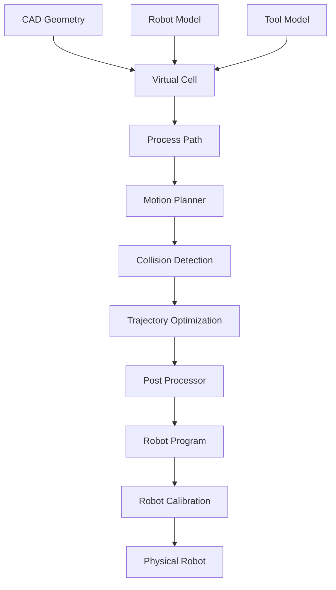


---


# Path Planning


Path planning consists of two related problems.


## Geometric Path Planning


Determine:


> How can the robot move from A to B without collision?


## Time Parameterization


Determine:


> How fast should the robot execute that path?


```text id="b6q7k3"

Geometric Path

      │

      ▼

Collision Check

      │

      ▼

Trajectory

      │

      ▼

Velocity Limits

      │

      ▼

Acceleration Limits

      │

      ▼

Time Parameterization

```


---


# Collision Detection


An industrial cell may contain thousands of collision geometries.


```text id="q2y6o1"

Robot Links

   +

Tool

   +

Part

   +

Fixture

   +

Conveyor

   +

Machine

   +

Environment

       │

       ▼

Collision Engine

       │

       ├── Distance

       ├── Collision

       ├── Continuous Collision

       └── Clearance

```


Useful libraries:


* FCL

* hpp-fcl

* Bullet

* PhysX

* ODE


---


# Reachability Analysis


A commercial simulator can calculate whether a robot can reach a target.


```text id="4p3w5c"

Target Surface

      │

      ▼

Candidate Poses

      │

      ▼

Inverse Kinematics

      │

      ▼

Joint Limits

      │

      ▼

Collision Check

      │

      ▼

Reachable Poses

```


A reachability map can be visualized as:


```text

        Robot Base

            ●

        .-"""""""-.

      .'           '.

     /   Reachable   \

    |     Volume      |

     \               /

      '.           .'

        '-._____.-'

```


---


# Cycle-Time Analysis


Cycle-time simulation is one of the most important commercial features.


A simplified calculation:


```text id="m3p8u5"

Cycle Time =


Pick

+

Robot Motion

+

Process

+

Place

+

Return

+

Tool Change

+

Conveyor Wait

+

Machine Wait

```


A simulator can identify:


* Robot idle time

* Machine idle time

* Bottlenecks

* Excessive robot motion

* Tool-change overhead

* Conveyor delays

* Buffer starvation


---


# Cycle-Time Architecture


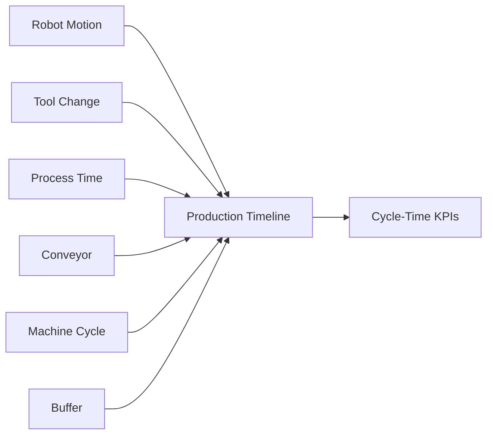


---


# Digital Twin


A useful robot-cell digital twin contains:


```text id="4y2v7z"

Geometry

+

Kinematics

+

Physics

+

Robot Program

+

PLC Logic

+

Sensors

+

Production Data

+

Actual Robot State

```


The twin should evolve from:


```text

Design Model

      ↓

Simulation Model

      ↓

Commissioning Model

      ↓

Production Model

      ↓

Live Digital Twin

```


---


# Virtual Commissioning


Virtual commissioning connects the simulated cell to automation logic.


```text id="j3v7b6"

             Virtual Cell

                  │

       ┌──────────┼──────────┐

       ▼          ▼          ▼

    Robot       PLC         HMI

  Controller   Logic       Screen

       │          │          │

       └──────────┼──────────┘

                  ▼

             Simulation

                  │

                  ▼

             Validation

```


---


# CAD Integration


A production-grade open-source workflow should support:


* STEP

* IGES

* STL

* OBJ

* glTF

* URDF

* SDF

* Meshes

* Point clouds


A typical pipeline:


```text

STEP / IGES

     │

     ▼

OpenCascade / FreeCAD

     │

     ▼

Mesh Conversion

     │

     ▼

Simulation Model

     │

     ▼

Gazebo / Webots / Custom Renderer

```


---


# Manufacturing Process Simulation


Robot simulation alone is insufficient for a Visual Components / Process Simulate / DELMIA-style environment.


A complete manufacturing simulation may contain:


```text

Robot

+

Conveyor

+

Machine

+

PLC

+

Operator

+

Buffer

+

Part

+

Process

+

Production Schedule

```


Architecture:


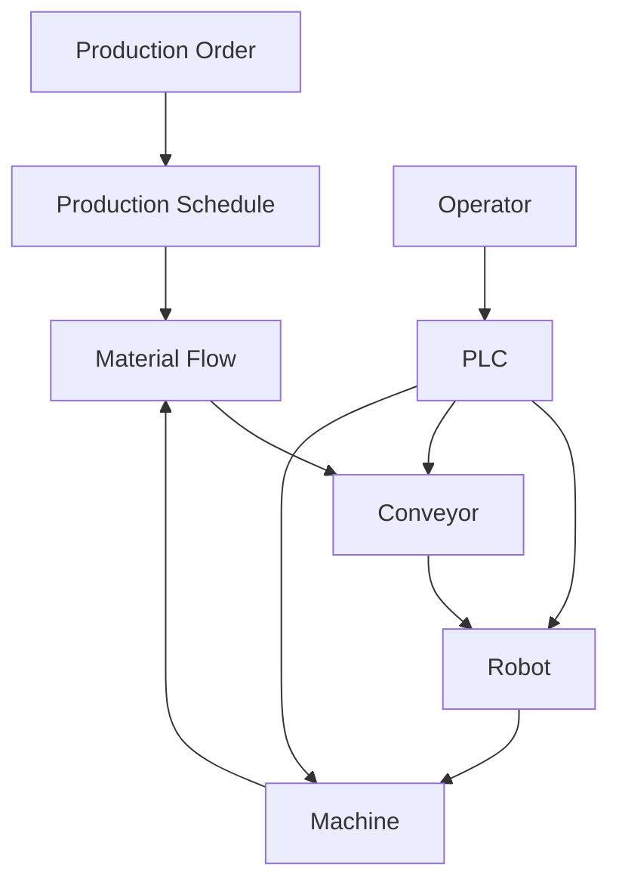


---


# Robot Calibration


Simulation-to-real accuracy depends heavily on calibration.


Important calibration targets:


* Robot base

* Tool Center Point

* Work object

* Fixtures

* Cameras

* External axes

* Conveyor coordinate systems


```text id="3w3n6q"

Simulation Frame

       │

       ▼

Calibration

       │

       ▼

Real Robot Frame

```


Useful open-source tools can be built from:


* ROS calibration packages

* OpenCV

* Industrial calibration algorithms

* Hand-eye calibration

* Point-cloud registration


---


# Simulation-to-Real


A robust workflow is:


```text

Simulation

    │

    ▼

Program Validation

    │

    ▼

Calibration

    │

    ▼

Dry Run

    │

    ▼

Low-Speed Run

    │

    ▼

Production Validation

```


Simulation should never be treated as proof that a physical robot cell is safe.


---


# AI / ML Integration


Open-source simulation can provide enormous value for AI.


Potential applications:


* Robot learning

* Reinforcement learning

* Vision

* Synthetic data

* Grasp planning

* Path optimization

* Predictive maintenance

* Process optimization

* Cycle-time optimization


Architecture:


```text id="s4u9z3"

Simulator

   │

   ├── Robot State

   ├── Camera

   ├── LiDAR

   ├── Force

   └── Environment

          │

          ▼

      Dataset

          │

          ▼

        Model

          │

          ▼

    Policy / Planner

          │

          ▼

      Simulator

```


---


# Synthetic Data


Blender, Gazebo, Webots and other simulators can generate:


* RGB images

* Depth images

* Segmentation masks

* Point clouds

* Robot trajectories

* Collision data

* Object poses


This can be used to train perception systems before deployment.


---


# Security & Deployment


A simulation platform used in an industrial environment should consider:


* Authentication

* Authorization

* CAD/IP protection

* Robot-program protection

* Network segmentation

* Signed software

* Audit logs

* Secure APIs

* Version control

* Reproducible simulation

* Containerized environments


Useful infrastructure:


| Requirement      | Open-Source Choice      |

| ---------------- | ----------------------- |

| Identity         | Keycloak                |

| Secrets          | OpenBao                 |

| Containers       | Docker                  |

| Orchestration    | Kubernetes              |

| Version Control  | Git                     |

| CI/CD            | GitLab / GitHub Actions |

| Observability    | Prometheus              |

| Dashboards       | Grafana                 |

| Artifact Storage | MinIO                   |

| API              | FastAPI / ROS 2         |

| Messaging        | MQTT / Zenoh            |


---


# Scalability


For many cells or large manufacturing systems:


```text

Simulation Jobs

      │

      ▼

Job Queue

      │

      ▼

Simulation Workers

      │

 ┌────┼────┬────┐

 ▼    ▼    ▼    ▼

Sim1 Sim2 Sim3 SimN

      │

      ▼

Results

      │

      ▼

Analytics

```


This makes it possible to run:


* Hundreds of path-planning experiments

* Thousands of parameter sweeps

* Multiple robot configurations

* Cycle-time optimization

* Monte Carlo simulations

* AI training workloads


---


# Cloud / Hosted Simulation Architecture


Although many industrial simulators remain desktop applications, an open platform can be designed for remote simulation:


```text

Browser

   │

   ▼

Web UI

   │

   ▼

Simulation API

   │

   ▼

Job Queue

   │

   ▼

GPU / CPU Workers

   │

   ├── Gazebo

   ├── MuJoCo

   ├── Blender

   └── Custom Simulator

   │

   ▼

Results

   │

   ▼

Browser

```


---


# Licensing


| Project           | License / Model                                           |

| ----------------- | --------------------------------------------------------- |

| Gazebo            | Apache-2.0                                                |

| Webots            | Apache-2.0                                                |

| MuJoCo            | Apache-2.0                                                |

| Drake             | BSD-3-Clause                                              |

| Bullet            | zlib                                                      |

| DART              | BSD                                                       |

| Newton            | Open source                                               |

| MoveIt 2          | BSD-3-Clause                                              |

| OMPL              | BSD                                                       |

| Tesseract         | Apache-2.0                                                |

| TrajOpt           | Apache-2.0 / project-dependent                            |

| FCL               | BSD                                                       |

| hpp-fcl           | BSD                                                       |

| ROS 2             | Apache-2.0                                                |

| ros2_control      | Apache-2.0                                                |

| ROS-Industrial    | Apache-2.0 / package-dependent                            |

| FreeCAD           | LGPL-2.1-or-later                                         |

| Blender           | GPL-3.0                                                   |

| OpenCascade       | LGPL-2.1 with additional terms                            |

| Open3D            | MIT                                                       |

| Assimp            | BSD-3-Clause                                              |

| OpenCV            | Apache-2.0                                                |

| PCL               | BSD                                                       |

| SimPy             | MIT                                                       |

| JaamSim           | GPL-3.0                                                   |

| OpenPLC           | GPL-2.0                                                   |

| Eclipse 4diac     | EPL-2.0                                                   |

| Three.js          | MIT                                                       |

| Babylon.js        | Apache-2.0                                                |

| MCAP              | MIT                                                       |

| CoppeliaSim       | **Not uniformly OSI-open-source; verify edition/license** |

| NVIDIA Isaac Sim  | **Mixed / NVIDIA-specific licensing**                     |

| RoboDK            | **Commercial / proprietary**                              |

| ABB RobotStudio   | **Commercial / proprietary**                              |

| KUKA.Sim          | **Commercial / proprietary**                              |

| FANUC ROBOGUIDE   | **Commercial / proprietary**                              |

| Visual Components | **Commercial / proprietary**                              |

| DELMIA            | **Commercial / proprietary**                              |

| OCTOPUZ           | **Commercial / proprietary**                              |


> Always verify the license of the exact release and all dependencies. A project being free to download, source-available, academically free, or having an open-source component does **not** necessarily make the complete product OSI-approved open source.


---


# Open-Source Architecture Patterns


## Pattern 1 — ROS 2 Industrial Simulation


```text

ROS 2

 │

 ├── Gazebo

 ├── MoveIt 2

 ├── Nav2

 ├── ros2_control

 └── RViz 2

```


Best general-purpose architecture.


---


## Pattern 2 — Industrial OLP


```text

CAD

 │

 ▼

FreeCAD / OpenCascade

 │

 ▼

Tesseract

 │

 ├── Kinematics

 ├── Collision

 ├── Planning

 └── Trajectory

       │

       ▼

Post Processor

       │

       ▼

Robot Program

```


---


## Pattern 3 — High-Fidelity Dynamics


```text

MuJoCo

+

Pinocchio

+

Drake

+

PyTorch

```


Best for research and AI.


---


## Pattern 4 — Manufacturing Cell


```text

FreeCAD

+

Gazebo

+

ROS 2

+

MoveIt 2

+

OpenPLC

+

SimPy

+

Blender

```


This is one of the strongest approaches for building a broader open manufacturing simulation environment.


---


# Open-Source Ecosystem Summary


| Layer                      | Recommended Projects        |

| -------------------------- | --------------------------- |

| Main Simulator             | **Gazebo**                  |

| Alternative Simulator      | **Webots**                  |

| Dynamics                   | **MuJoCo / Drake**          |

| Physics                    | **Bullet / PhysX / DART**   |

| Industrial Motion Planning | **MoveIt 2 / Tesseract**    |

| Motion Planning            | **OMPL**                    |

| Trajectory Optimization    | **TrajOpt / CHOMP / STOMP** |

| Kinematics                 | **KDL / Pinocchio**         |

| Collision                  | **FCL / hpp-fcl**           |

| Robot Middleware           | **ROS 2**                   |

| Industrial Robotics        | **ROS-Industrial**          |

| Robot Control              | **ros2_control**            |

| CAD                        | **FreeCAD**                 |

| Geometry Kernel            | **OpenCascade**             |

| 3D Creation                | **Blender**                 |

| 3D Geometry                | **Open3D**                  |

| Computer Vision            | **OpenCV**                  |

| Point Clouds               | **PCL / Open3D**            |

| Asset Import               | **Assimp**                  |

| Factory Simulation         | **SimPy / JaamSim**         |

| PLC Simulation             | **OpenPLC / Eclipse 4diac** |

| Web 3D                     | **Three.js / Babylon.js**   |

| Visualization              | **RViz 2 / Foxglove**       |

| Data                       | **MCAP**                    |

| Automation                 | **Python**                  |

| AI                         | **PyTorch**                 |

| Containerization           | **Docker**                  |

| Cloud Orchestration        | **Kubernetes**              |


---


# Open-Source Shortlist


## Tier 1 — Most Important


### Gazebo


**Best overall open-source robotics simulator**


https://gazebosim.org/


Why:


* Mature

* ROS 2 integration

* 3D simulation

* Physics

* Sensors

* Manipulators

* Mobile robots

* Open source

* Large ecosystem


Gazebo is currently one of the leading open-source robotics simulation platforms.


---


### MoveIt 2


**Best open-source manipulation and motion-planning framework**


https://github.com/moveit/moveit2


Why:


* Motion planning

* IK

* Collision checking

* Trajectory generation

* ROS 2

* Industrial manipulators

* Extensible planners


---


### Tesseract


**One of the most interesting open-source foundations for industrial robot programming**


https://github.com/tesseract-robotics/tesseract


Why:


* Industrial robotics

* Environment representation

* Collision checking

* Trajectory processing

* Planning

* Optimization


---


### MuJoCo


**Best open-source physics engine for many robotics/control workloads**


https://github.com/google-deepmind/mujoco


Why:


* High-quality dynamics

* Contact simulation

* Manipulators

* Control

* Reinforcement learning

* Fast simulation


---


### Webots


**Best complete open-source simulator for accessible robotics development**


https://github.com/cyberbotics/webots


Why:


* Complete environment

* Good GUI

* Sensors

* Robots

* Physics

* Multi-platform

* ROS integration


---


### Drake


**Best mathematical robotics simulation / planning framework**


https://github.com/RobotLocomotion/drake


Why:


* Dynamics

* Optimization

* Planning

* Control

* Manipulation

* Rigorous mathematical foundation


---


# Tier 2 — Important


* [OMPL](https://github.com/ompl/ompl)

* [Pinocchio](https://github.com/stack-of-tasks/pinocchio)

* [ros2_control](https://github.com/ros-controls/ros2_control)

* [ROS-Industrial](https://github.com/ros-industrial)

* [FreeCAD](https://github.com/FreeCAD/FreeCAD)

* [OpenCascade](https://github.com/Open-Cascade-SAS/OCCT)

* [Blender](https://github.com/blender/blender)

* [FCL](https://github.com/flexible-collision-library/fcl)

* [Open3D](https://github.com/isl-org/Open3D)

* [OpenCV](https://github.com/opencv/opencv)

* [PCL](https://github.com/PointCloudLibrary/pcl)

* [PyBullet](https://github.com/bulletphysics/bullet3)

* [SimPy](https://github.com/simpx/simpy)

* [JaamSim](https://github.com/jaamsim/jaamsim)

* [OpenPLC](https://github.com/thiagoralves/OpenPLC_v3)

* [Eclipse 4diac](https://github.com/eclipse-4diac/4diac-ide)

* [Three.js](https://github.com/mrdoob/three.js)


---


# Why Gazebo Is Particularly Important


Gazebo is one of the closest open-source foundations for a general robot-cell simulation environment.


It provides:


```text

World

 │

 ├── Robot

 ├── Physics

 ├── Sensors

 ├── Controllers

 ├── Plugins

 ├── Environment

 └── ROS 2

```


However:


```text

Gazebo

  ≠

Visual Components

```


because Visual Components adds substantially more manufacturing-oriented functionality around:


* Factory layout

* Production processes

* Manufacturing equipment

* Discrete-event logic

* Robot libraries

* Engineering workflows


Therefore an open-source Visual Components alternative requires additional components.


---


# Why CoppeliaSim Is Particularly Interesting


CoppeliaSim is unusually strong for integrated robotics simulation.


It combines:


* Robot models

* Sensors

* Physics

* Scripting

* APIs

* Manipulation

* Motion planning

* Visualization


It has historically been compared with Gazebo and Webots in simulator research.


However, for this README's **strict open-source emphasis**, CoppeliaSim should be treated separately from projects such as Gazebo, Webots and MuJoCo because its licensing depends on the edition and is not equivalent to an OSI-open-source project.


---


# Why MuJoCo Is Particularly Interesting


MuJoCo is particularly powerful when the primary requirement is:


```text

Robot Dynamics

+

Contact

+

Control

+

Optimization

+

AI

```


rather than:


```text

Complete Factory Layout

+

PLC

+

Manufacturing Processes

+

Industrial OLP

```


Therefore:


```text

MuJoCo → excellent physics/control

Gazebo → broader robotics simulation

```


---


# Why Drake Is Particularly Interesting


Drake is particularly valuable for mathematically rigorous robotics.


It integrates:


* Multibody dynamics

* Kinematics

* Optimization

* Control

* Planning

* Trajectory optimization

* Simulation


A research-oriented industrial robotics stack can therefore be:


```text

Drake

+

Pinocchio

+

OMPL

+

ROS 2

+

Gazebo

```


---


# Building an ABB RobotStudio Alternative


RobotStudio's distinctive strength is its ABB Virtual Controller and close relationship with real ABB robot behavior. ABB describes its Virtual Controller as an exact copy of the software running on production robots, enabling programs and configurations to be tested in a virtual cell.


An open-source approximation would be:


```text

Gazebo

+

ROS 2

+

MoveIt 2

+

Tesseract

+

ABB ROS packages

+

FreeCAD

+

FCL

+

ABB-specific post processor

```


Architecture:


```text

CAD

 │

 ▼

FreeCAD

 │

 ▼

Virtual Cell

 │

 ▼

Tesseract / MoveIt

 │

 ├── IK

 ├── Planning

 ├── Collision

 └── Optimization

       │

       ▼

ABB Post Processor

       │

       ▼

RAPID

```


### Major limitation


This does **not** reproduce the ABB Virtual Controller.


A true open-source alternative would need a sufficiently accurate model of:


* RAPID semantics

* ABB motion behavior

* Controller timing

* Configuration

* Error handling

* I/O

* Motion supervision


That is a substantial engineering project.


---


# Building a KUKA.Sim Alternative


Suggested stack:


```text

Gazebo

+

ROS 2

+

MoveIt 2

+

Tesseract

+

OMPL

+

FCL

+

KUKA ROS packages

+

KRL post processor

```


Architecture:


```text

Robot Model

    │

    ▼

MoveIt / Tesseract

    │

    ▼

Trajectory

    │

    ▼

KRL Post Processor

    │

    ▼

KUKA Robot

```


Again, this does not reproduce the proprietary KUKA controller simulator.


---


# Building a FANUC ROBOGUIDE Alternative


Suggested stack:


```text

Gazebo

+

ROS 2

+

MoveIt 2

+

Tesseract

+

FCL

+

FANUC ROS packages

+

FANUC post processor

```


Pipeline:


```text

CAD

 │

 ▼

Cell

 │

 ▼

Robot Path

 │

 ▼

Collision Check

 │

 ▼

Trajectory

 │

 ▼

FANUC Post Processor

 │

 ▼

TP / LS

```


The difficult part is accurately reproducing FANUC controller behavior.


---


# Building a RoboDK Alternative


RoboDK is primarily a multi-brand simulation and offline-programming environment. Its current platform advertises support for more than 1,400 robot models from 80 manufacturers and provides post-processors for many controller families.


A modular open-source alternative would be:


```text

FreeCAD

+

Gazebo

+

MoveIt 2

+

Tesseract

+

OMPL

+

FCL

+

ROS-Industrial

+

Robot Post Processors

```


Architecture:


```text

                 Robot Library

                      │

        ┌─────────────┼─────────────┐

        ▼             ▼             ▼

       ABB           KUKA         FANUC

        │             │             │

        └─────────────┼─────────────┘

                      ▼

                 Generic Robot

                      │

                      ▼

               Motion Planner

                      │

                      ▼

                Post Processor

                      │

          ┌───────────┼───────────┐

          ▼           ▼           ▼

        RAPID         KRL         TP

```


---


# Building a Visual Components Alternative


Visual Components is much broader than robot simulation.


A realistic open-source architecture requires:


```text

FreeCAD

+

Blender

+

Gazebo

+

ROS 2

+

MoveIt 2

+

SimPy

+

OpenPLC

+

OpenCascade

+

PostgreSQL

```


Architecture:


```text

                    Factory Model

                         │

       ┌─────────────────┼─────────────────┐

       ▼                 ▼                 ▼

     CAD              Robots            Machines

       │                 │                 │

       ▼                 ▼                 ▼

  FreeCAD             Gazebo          Process Model

       │                 │                 │

       └─────────────────┼─────────────────┘

                         ▼

                   Production Logic

                         │

                         ▼

                       SimPy

                         │

                         ▼

                    KPI Analysis

```


This is one of the more difficult commercial platforms to reproduce because it combines:


* 3D layout

* Robotics

* Manufacturing

* Discrete events

* Engineering libraries

* Factory logic


---


# Building a Siemens Process Simulate Alternative


Process Simulate is fundamentally a **manufacturing and virtual-commissioning environment**, not merely a robot simulator.


An open-source approximation:


```text

FreeCAD

+

Gazebo

+

MoveIt 2

+

OpenPLC

+

SimPy

+

ROS 2

+

OPC UA

+

Three.js

```


Architecture:


```text

CAD

 │

 ▼

Virtual Factory

 │

 ├── Robots

 ├── Machines

 ├── Conveyors

 ├── PLC

 ├── Sensors

 └── Operators

       │

       ▼

Discrete Event Model

       │

       ▼

Production Simulation

       │

       ▼

Virtual Commissioning

```


---


# Building an OCTOPUZ Alternative


OCTOPUZ is strongly oriented toward robotic offline programming and complex process paths.


An open-source alternative should emphasize:


```text

Tesseract

+

MoveIt 2

+

TrajOpt

+

OMPL

+

FCL

+

FreeCAD

+

OpenCascade

+

Robot Post Processors

```


Particularly important capabilities:


* Surface path generation

* Welding paths

* Cutting

* Machining

* Polishing

* Painting

* Additive manufacturing

* Collision avoidance

* External axes

* Multi-axis synchronization


---


# Building a DELMIA Robotics Alternative


DELMIA operates at a much broader digital-manufacturing level.


A fully open alternative would need:


```text

CAD

+

Factory Layout

+

Robot Simulation

+

Process Simulation

+

Discrete Events

+

PLC

+

MES

+

Digital Twin

```


Potential open-source stack:


```text

FreeCAD

+

OpenCascade

+

Gazebo

+

MoveIt 2

+

Tesseract

+

SimPy

+

OpenPLC

+

ROS 2

+

PostgreSQL

+

Three.js

```


---


# Building a Fully Open Robot Cell Simulator


A serious open-source platform could be architected as:


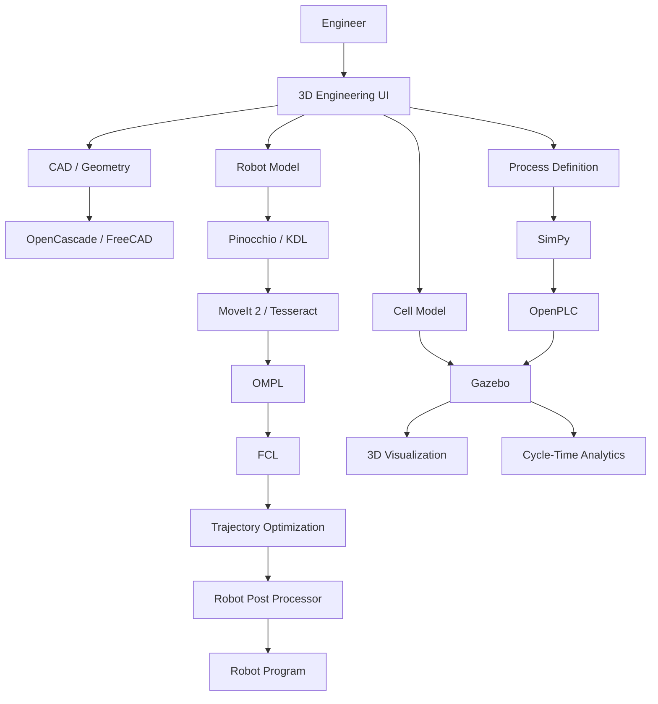


---


# Fully Open Robot Cell Stack


The resulting platform could look like:


```text

                         ROBOT CELL SIMULATOR

                                  │

       ┌──────────────────────────┼─────────────────────────┐

       │                          │                         │

       ▼                          ▼                         ▼

      CAD                       Robot                    Process

       │                          │                         │

   FreeCAD                    ROS 2                      SimPy

 OpenCascade                MoveIt 2                   OpenPLC

       │                    Tesseract                      │

       └──────────────┬───────────┴────────────────────────┘

                      ▼

                Virtual Cell

                      │

                      ▼

                   Gazebo

                      │

             ┌────────┼────────┐

             ▼        ▼        ▼

          Physics   Sensors   Controllers

             │        │        │

             └────────┼────────┘

                      ▼

               Collision / Path

                      │

                      ▼

                Optimization

                      │

                      ▼

               Post Processing

                      │

                      ▼

                Robot Program

```


---


# Comparison of Open-Source Simulation Strategies


## Strategy A — Gazebo-Centric


```text

Gazebo

+

ROS 2

+

MoveIt 2

```


### Advantages


* Easy ecosystem integration

* Strong ROS support

* Open source

* Large community

* Sensors

* Physics


### Limitations


* Requires substantial engineering for industrial OLP

* Factory/process simulation is not its primary purpose

* Vendor controller emulation is absent


---


## Strategy B — Tesseract-Centric


```text

Tesseract

+

MoveIt 2

+

OMPL

+

TrajOpt

+

FCL

```


### Advantages


* Strong industrial robotics

* Motion planning

* Collision checking

* Trajectory optimization


### Limitations


* Not a complete visual factory simulator

* Requires UI and CAD integration

* Requires robot post processors


---


## Strategy C — MuJoCo-Centric


```text

MuJoCo

+

Pinocchio

+

PyTorch

```


### Advantages


* Excellent dynamics

* AI

* Reinforcement learning

* Fast simulation


### Limitations


* Not an industrial OLP platform

* Limited manufacturing process modeling

* Requires significant application development


---


## Strategy D — Full Open Manufacturing Stack


```text

FreeCAD

+

OpenCascade

+

Gazebo

+

MoveIt 2

+

Tesseract

+

SimPy

+

OpenPLC

+

ROS 2

+

Three.js

```


### Advantages


* Broadest coverage

* Fully composable

* Self-hosted

* Highly customizable


### Limitations


* Significant integration work

* No single unified UX

* Vendor-specific controller fidelity must be developed

* Requires engineering resources


---


# Recommended Open-Source Architecture


For most organizations wanting to build a serious open-source robot-cell simulator:


```text

                 ┌─────────────────────┐

                 │      FreeCAD        │

                 │   CAD / Workcell    │

                 └──────────┬──────────┘

                            │

                            ▼

                 ┌─────────────────────┐

                 │    OpenCascade      │

                 │ Geometry / STEP     │

                 └──────────┬──────────┘

                            │

                            ▼

                 ┌─────────────────────┐

                 │      Gazebo         │

                 │ 3D + Physics + Sim  │

                 └──────────┬──────────┘

                            │

                            ▼

                 ┌─────────────────────┐

                 │      ROS 2          │

                 └──────────┬──────────┘

                            │

                ┌───────────┴───────────┐

                ▼                       ▼

          ┌────────────┐          ┌────────────┐

          │ MoveIt 2   │          │ Tesseract  │

          └─────┬──────┘          └─────┬──────┘

                │                       │

                └───────────┬───────────┘

                            ▼

                     ┌────────────┐

                     │    OMPL    │

                     └─────┬──────┘

                           ▼

                     ┌────────────┐

                     │    FCL     │

                     └─────┬──────┘

                           ▼

                   Trajectory Optimization

                           │

                           ▼

                    Robot Post Processor

                           │

                           ▼

                  ABB / KUKA / FANUC /

                  Yaskawa / UR / etc.

```


---


# Final Open-Source Shortlist


| Rank | Project            | Best For                                |

| ---: | ------------------ | --------------------------------------- |

|    1 | **Gazebo**         | General robot-cell simulation           |

|    2 | **MoveIt 2**       | Industrial manipulation / planning      |

|    3 | **Tesseract**      | Industrial robot programming            |

|    4 | **MuJoCo**         | Dynamics / AI / control                 |

|    5 | **Webots**         | Complete accessible robot simulation    |

|    6 | **Drake**          | Mathematical robotics / optimization    |

|    7 | **OMPL**           | Motion planning                         |

|    8 | **FreeCAD**        | CAD / workcell engineering              |

|    9 | **OpenCascade**    | CAD geometry kernel                     |

|   10 | **Pinocchio**      | Kinematics / dynamics                   |

|   11 | **FCL**            | Collision detection                     |

|   12 | **ros2_control**   | Robot control                           |

|   13 | **ROS-Industrial** | Industrial robot integration            |

|   14 | **PyBullet**       | Physics / prototyping                   |

|   15 | **Blender**        | 3D / visualization / synthetic data     |

|   16 | **Open3D**         | 3D geometry / point clouds              |

|   17 | **OpenCV**         | Computer vision                         |

|   18 | **PCL**            | Point-cloud processing                  |

|   19 | **SimPy**          | Manufacturing process simulation        |

|   20 | **OpenPLC**        | PLC simulation                          |

|   21 | **Eclipse 4diac**  | Industrial automation                   |

|   22 | **Three.js**       | Web-based 3D                            |

|   23 | **JaamSim**        | Discrete-event manufacturing simulation |

|   24 | **Newton**         | GPU physics / robotics                  |

|   25 | **TrajOpt**        | Industrial trajectory optimization      |


---


# Conclusion


The open-source robotics ecosystem is strong enough to build a substantial alternative to the **robotics and simulation layers** of:


* ABB RobotStudio

* KUKA.Sim

* Visual Components

* Siemens Process Simulate

* FANUC ROBOGUIDE

* Visual Components Premium

* DELMIA Robotics

* OCTOPUZ

* RoboDK

* Visual Components Essentials


However, **no single open-source project is currently a complete one-for-one replacement for all of these industrial suites**.


The strongest strategy is compositional:


```text

                     OPEN ROBOT CELL PLATFORM

                              │

         ┌────────────────────┼────────────────────┐

         │                    │                    │

         ▼                    ▼                    ▼

       CAD                 Simulation          Robotics

         │                    │                    │

     FreeCAD               Gazebo              ROS 2

   OpenCascade             MuJoCo             MoveIt 2

         │                 Webots             Tesseract

         │                    │                    │

         └────────────────────┼────────────────────┘

                              ▼

                       Motion Planning

                              │

                    OMPL / TrajOpt / Drake

                              │

                              ▼

                       Collision Checking

                              │

                           FCL / Bullet

                              │

                              ▼

                       Process Simulation

                              │

                     SimPy / OpenPLC

                              │

                              ▼

                       Offline Programming

                              │

                       Post Processors

                              │

                              ▼

                   ABB / KUKA / FANUC /

                   Yaskawa / UR / etc.

```


### Overall Open-Source Recommendation


| Requirement                                  | First Choice                                        |

| -------------------------------------------- | --------------------------------------------------- |

| **Best overall open simulator**              | **Gazebo**                                          |

| **Best open manipulation framework**         | **MoveIt 2**                                        |

| **Best industrial robotics framework**       | **Tesseract**                                       |

| **Best physics/control platform**            | **MuJoCo**                                          |

| **Best mathematical robotics platform**      | **Drake**                                           |

| **Best open robot planning library**         | **OMPL**                                            |

| **Best industrial robot integration**        | **ROS-Industrial**                                  |

| **Best robot control framework**             | **ros2_control**                                    |

| **Best CAD platform**                        | **FreeCAD**                                         |

| **Best CAD geometry kernel**                 | **OpenCascade**                                     |

| **Best kinematics/dynamics library**         | **Pinocchio**                                       |

| **Best collision library**                   | **FCL / hpp-fcl**                                   |

| **Best open 3D platform**                    | **Blender**                                         |

| **Best point-cloud platform**                | **Open3D / PCL**                                    |

| **Best factory-process building block**      | **SimPy / JaamSim**                                 |

| **Best open PLC platform**                   | **OpenPLC**                                         |

| **Best web visualization**                   | **Three.js / Babylon.js**                           |

| **Best AI simulation foundation**            | **MuJoCo + PyTorch**                                |

| **Best open industrial OLP foundation**      | **Tesseract + MoveIt 2**                            |

| **Best complete open robot-cell foundation** | **Gazebo + ROS 2 + MoveIt 2 + Tesseract + FreeCAD** |


> **Bottom line:** If the goal is to build a genuinely open-source alternative to **RobotStudio/KUKA.Sim/ROBOGUIDE/RoboDK**, start with **Gazebo + ROS 2 + MoveIt 2 + Tesseract + OMPL + FCL** and add **FreeCAD/OpenCascade** for engineering geometry. If the goal extends to **Visual Components / Process Simulate / DELMIA**, add **SimPy/JaamSim + OpenPLC + Three.js/Blender + a manufacturing-process model**. The resulting architecture will be far more modular and open than a conventional commercial suite, although reproducing proprietary virtual-controller fidelity and validated manufacturer-specific post-processors remains the major gap.


---


# Contributing


Contributions are welcome.


Useful contributions include:


* Additional open-source robot simulators

* Industrial robot models

* URDF/SDF models

* Robot drivers

* MoveIt configurations

* Tesseract integrations

* Motion planners

* Collision libraries

* Robot post-processors

* CAD converters

* Manufacturing-process models

* PLC integrations

* OPC UA integrations

* Virtual-commissioning examples

* Digital-twin implementations

* Cycle-time benchmarks

* Simulation-to-real benchmarks

* Synthetic-data datasets

* Industrial robot calibration tools

* Multi-robot examples


---


# Disclaimer


This README is intended as a technical reference and architecture guide.


Software capabilities, supported robot models, APIs, licensing, repositories and commercial offerings can change. Always verify the current repository, documentation and license before using any project in production.


Particular attention should be paid to:


* Robot-controller licensing

* Manufacturer-specific APIs

* Robot-program licensing

* Post-processor licensing

* CAD-data licensing

* STEP/IGES/3D-model redistribution

* Open-source dependencies

* Simulation accuracy

* Physics-model assumptions

* Industrial safety requirements

* Functional safety

* Robot calibration

* Production validation

* PLC and machine-control interfaces


A simulation result is **not** by itself proof that a physical robotic cell is safe or production-ready.


---


# Recommended Starting Stack


```text

                         ┌─────────────────────┐

                         │      Engineer       │

                         └──────────┬──────────┘

                                    │

                                    ▼

                         ┌─────────────────────┐

                         │  3D / CAD Workcell  │

                         │ FreeCAD / Blender   │

                         └──────────┬──────────┘

                                    │

                                    ▼

                         ┌─────────────────────┐

                         │      Gazebo         │

                         │ Physics + Sensors   │

                         └──────────┬──────────┘

                                    │

                                    ▼

                         ┌─────────────────────┐

                         │       ROS 2         │

                         └──────────┬──────────┘

                                    │

                  ┌─────────────────┼─────────────────┐

                  ▼                 ▼                 ▼

            ┌───────────┐    ┌───────────┐    ┌───────────┐

            │ MoveIt 2  │    │ Tesseract │    │ros2_control│

            └─────┬─────┘    └─────┬─────┘    └─────┬─────┘

                  │                 │                 │

                  └─────────────────┼─────────────────┘

                                    ▼

                         ┌─────────────────────┐

                         │ OMPL / TrajOpt /    │

                         │ Drake / Pinocchio   │

                         └──────────┬──────────┘

                                    │

                                    ▼

                         ┌─────────────────────┐

                         │ FCL / hpp-fcl       │

                         │ Collision Checking  │

                         └──────────┬──────────┘

                                    │

                                    ▼

                         ┌─────────────────────┐

                         │ Trajectory / Path   │

                         │ Optimization         │

                         └──────────┬──────────┘

                                    │

                                    ▼

                         ┌─────────────────────┐

                         │ Robot Post-Processor│

                         └──────────┬──────────┘

                                    │

                 ┌──────────────────┼──────────────────┐

                 ▼                  ▼                  ▼

               ABB                KUKA               FANUC

              RAPID                KRL                 TP

                 │                  │                  │

                 └──────────────────┼──────────────────┘

                                    ▼

                           Physical Robot Cell

```


**This stack provides the foundation for a genuinely self-hosted, open-source robot-cell simulation and offline-programming platform rather than merely a robotics physics simulator.**
